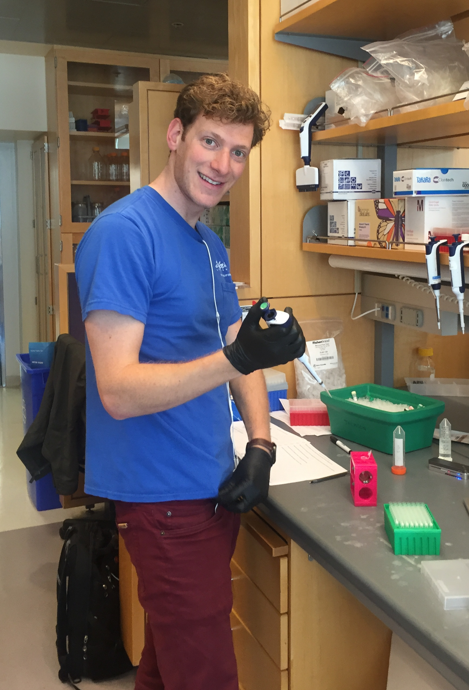

I recently graduated from UC San Francisco with a PhD in Biomedical informatics. I worked on statistical methods and new data models for single cell RNA-seq data. I look for inspiration from image processing, Natural Language Processing, and other engineering/computational fields. Contrary to the image shown, my work is purely computational.

For my undergraduate I studied Electrical Engineering at University of Illinois Urbana-Champaign.

**email**: gheimberg at gmail
